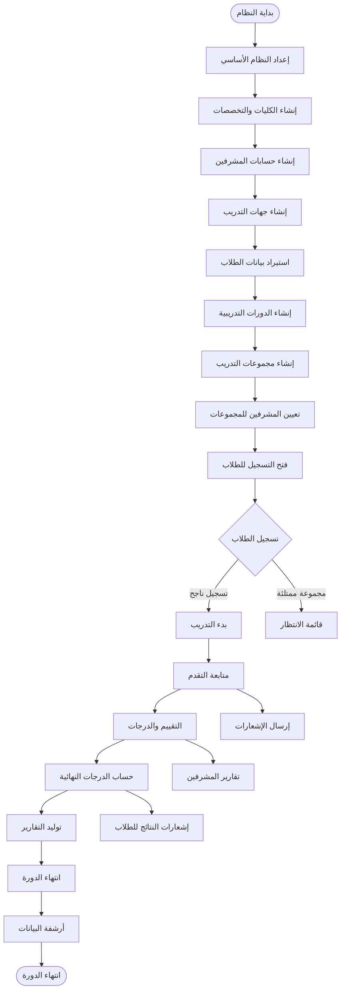
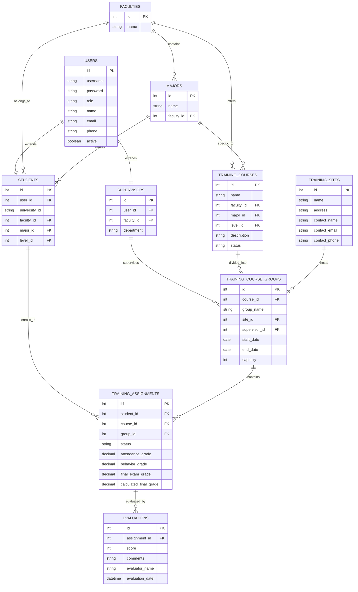

# مخططات حالات الاستخدام لنظام إدارة التدريب الميداني

## 1. مخطط حالات الاستخدام العام للنظام

```mermaid
graph TD
    %% تعريف المستخدمين
    Admin[المسؤول]
    Supervisor[المشرف]
    Student[الطالب]
    
    %% النظام الرئيسي
    System[نظام إدارة التدريب الميداني]
    
    %% حالات الاستخدام للمسؤول
    AdminUC1[إدارة المستخدمين]
    AdminUC2[إدارة الكليات والتخصصات]
    AdminUC3[إدارة الدورات التدريبية]
    AdminUC4[إدارة جهات التدريب]
    AdminUC5[استيراد بيانات الطلاب]
    AdminUC6[توليد التقارير]
    AdminUC7[مراقبة النشاطات]
    AdminUC8[إدارة السنوات الدراسية]
    
    %% حالات الاستخدام للمشرف
    SuperUC1[عرض الطلاب المُعينين]
    SuperUC2[إدخال التقييمات]
    SuperUC3[متابعة تقدم الطلاب]
    SuperUC4[إدارة المجموعات]
    SuperUC5[إدخال الدرجات المفصلة]
    
    %% حالات الاستخدام للطالب
    StudentUC1[تصفح الدورات المتاحة]
    StudentUC2[التسجيل في الدورات]
    StudentUC3[عرض النتائج والدرجات]
    StudentUC4[متابعة حالة التدريب]
    StudentUC5[إلغاء التسجيل]
    
    %% الروابط
    Admin --- AdminUC1
    Admin --- AdminUC2
    Admin --- AdminUC3
    Admin --- AdminUC4
    Admin --- AdminUC5
    Admin --- AdminUC6
    Admin --- AdminUC7
    Admin --- AdminUC8
    
    Supervisor --- SuperUC1
    Supervisor --- SuperUC2
    Supervisor --- SuperUC3
    Supervisor --- SuperUC4
    Supervisor --- SuperUC5
    
    Student --- StudentUC1
    Student --- StudentUC2
    Student --- StudentUC3
    Student --- StudentUC4
    Student --- StudentUC5
    
    AdminUC1 -.-> System
    AdminUC2 -.-> System
    AdminUC3 -.-> System
    AdminUC4 -.-> System
    AdminUC5 -.-> System
    AdminUC6 -.-> System
    AdminUC7 -.-> System
    AdminUC8 -.-> System
    
    SuperUC1 -.-> System
    SuperUC2 -.-> System
    SuperUC3 -.-> System
    SuperUC4 -.-> System
    SuperUC5 -.-> System
    
    StudentUC1 -.-> System
    StudentUC2 -.-> System
    StudentUC3 -.-> System
    StudentUC4 -.-> System
    StudentUC5 -.-> System
```

## 2. مخطط حالات الاستخدام المفصل للمسؤول

```mermaid
graph TD
    Admin[المسؤول<br/>Administrator]
    
    %% إدارة المستخدمين
    UC1[إنشاء حساب مشرف]
    UC2[إنشاء حساب طالب]
    UC3[تعديل بيانات المستخدمين]
    UC4[تفعيل/إلغاء تفعيل الحسابات]
    UC5[حذف المستخدمين]
    
    %% إدارة الهيكل الأكاديمي
    UC6[إضافة كلية جديدة]
    UC7[إضافة تخصص جديد]
    UC8[تعديل الكليات والتخصصات]
    UC9[إدارة المستويات الدراسية]
    
    %% إدارة التدريب
    UC10[إنشاء دورة تدريبية]
    UC11[إنشاء مجموعات التدريب]
    UC12[تعيين المشرفين للمجموعات]
    UC13[إدارة جهات التدريب]
    UC14[متابعة حالة الدورات]
    
    %% إدارة البيانات والتقارير
    UC15[استيراد بيانات من Excel]
    UC16[تصدير التقارير]
    UC17[مراقبة سجل النشاطات]
    UC18[إدارة الإشعارات]
    
    Admin --- UC1
    Admin --- UC2
    Admin --- UC3
    Admin --- UC4
    Admin --- UC5
    Admin --- UC6
    Admin --- UC7
    Admin --- UC8
    Admin --- UC9
    Admin --- UC10
    Admin --- UC11
    Admin --- UC12
    Admin --- UC13
    Admin --- UC14
    Admin --- UC15
    Admin --- UC16
    Admin --- UC17
    Admin --- UC18
    
    %% الإضافات المتقدمة
    UC15 --> UC19[التحقق من صحة البيانات]
    UC16 --> UC20[اختيار تنسيق التصدير]
    UC17 --> UC21[البحث والفلترة في السجلات]
```

## 3. مخطط حالات الاستخدام المفصل للمشرف

```mermaid
graph TD
    Supervisor[المشرف<br/>Supervisor]
    
    %% إدارة الطلاب
    UC1[عرض الطلاب المُعينين]
    UC2[متابعة حضور الطلاب]
    UC3[تقييم أداء الطلاب]
    UC4[إدخال ملاحظات]
    
    %% نظام التقييم
    UC5[إدخال درجة الحضور]
    UC6[إدخال درجة السلوك]
    UC7[إدخال درجة الاختبار النهائي]
    UC8[حساب الدرجة النهائية]
    UC9[تعديل التقييمات]
    
    %% إدارة المجموعات
    UC10[عرض تفاصيل المجموعة]
    UC11[متابعة جدول التدريب]
    UC12[التواصل مع جهة التدريب]
    
    %% التقارير والإشعارات
    UC13[إرسال تقرير للإدارة]
    UC14[استلام الإشعارات]
    UC15[عرض تقرير تقدم الطلاب]
    
    Supervisor --- UC1
    Supervisor --- UC2
    Supervisor --- UC3
    Supervisor --- UC4
    Supervisor --- UC5
    Supervisor --- UC6
    Supervisor --- UC7
    Supervisor --- UC8
    Supervisor --- UC9
    Supervisor --- UC10
    Supervisor --- UC11
    Supervisor --- UC12
    Supervisor --- UC13
    Supervisor --- UC14
    Supervisor --- UC15
    
    %% العلاقات المتقدمة
    UC5 --> UC16[التحقق من نسبة الحضور]
    UC6 --> UC17[تقييم التفاعل والسلوك]
    UC7 --> UC18[إجراء الاختبار النهائي]
    UC8 --> UC19[تطبيق معادلة الحساب<br/>20% + 30% + 50%]
    
    UC13 --> UC20[إرسال إشعار تلقائي للإدارة]
```

## 4. مخطط حالات الاستخدام المفصل للطالب

```mermaid
graph TD
    Student[الطالب<br/>Student]
    
    %% تصفح والتسجيل
    UC1[تصفح الدورات المتاحة]
    UC2[عرض تفاصيل الدورة]
    UC3[التحقق من التوافق مع التخصص]
    UC4[التسجيل في المجموعة]
    UC5[تأكيد التسجيل]
    
    %% إدارة التسجيل
    UC6[عرض الدورات المسجل بها]
    UC7[إلغاء التسجيل]
    UC8[تغيير المجموعة]
    UC9[متابعة حالة التدريب]
    
    %% النتائج والتقييمات
    UC10[عرض النتائج والدرجات]
    UC11[عرض تفاصيل التقييم]
    UC12[تحميل شهادة إتمام]
    UC13[عرض التقرير النهائي]
    
    %% الإشعارات والمتابعة
    UC14[استلام الإشعارات]
    UC15[عرض جدول التدريب]
    UC16[عرض معلومات المشرف]
    UC17[عرض معلومات جهة التدريب]
    
    Student --- UC1
    Student --- UC2
    Student --- UC3
    Student --- UC4
    Student --- UC5
    Student --- UC6
    Student --- UC7
    Student --- UC8
    Student --- UC9
    Student --- UC10
    Student --- UC11
    Student --- UC12
    Student --- UC13
    Student --- UC14
    Student --- UC15
    Student --- UC16
    Student --- UC17
    
    %% القيود والشروط
    UC3 --> UC18[التحقق من الكلية والتخصص]
    UC4 --> UC19[التحقق من الأماكن المتاحة]
    UC5 --> UC20[التحقق من عدم التسجيل المكرر]
    UC10 --> UC21[عرض الدرجات المفصلة<br/>حضور + سلوك + نهائي]
```

## 5. مخطط تدفق العمليات الرئيسية

## 6. مخطط العلاقات بين الكيانات الرئيسية

هذه المخططات توضح بشكل شامل ومفصل جميع وظائف النظام وحالات الاستخدام لكل نوع من المستخدمين، والعلاقات بين الكيانات المختلفة في النظام.
